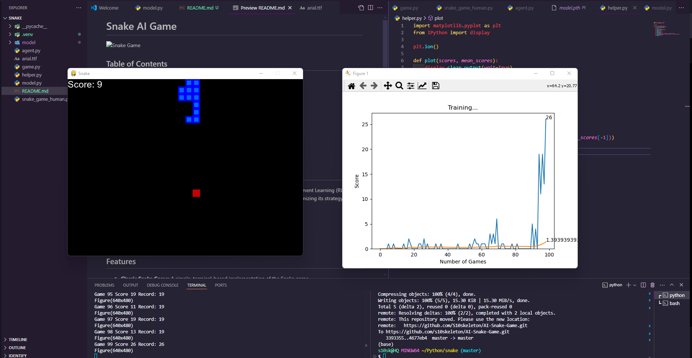

# Snake AI Game

 <!-- Replace with actual screenshot if available -->

## Table of Contents
- [Overview](#overview)
- [Features](#features)
- [Installation](#installation)
- [Usage](#usage)
- [AI Training](#ai-training)
- [Visualization](#visualization)
- [Dependencies](#dependencies)
- [Contributing](#contributing)
- [License](#license)
- [Contact](#contact)

## Overview

This project implements a classic Snake game with an AI agent trained using Reinforcement Learning (RL) to play the game autonomously. The AI learns by playing multiple iterations of the game, optimizing its strategy based on rewards and penalties.

The project is divided into two main components:
1. **Game:** The classic Snake game implemented in Python.
2. **AI Agent:** A Deep Q-Network (DQN) based agent that learns to play the game.

## Features

- **Classic Snake Game:** A simple, terminal-based implementation of the Snake game.
- **AI Training:** A DQN-based agent that learns to play the game through self-play.
- **State Visualization:** Heatmaps showing the AI's action preferences during gameplay.
- **Save and Load Models:** The ability to save the trained model and continue training from where it left off.
- **Customizable Parameters:** Easily adjustable training parameters, such as learning rate, discount factor, etc.

## Installation

To run this project locally, you'll need to clone the repository and install the required dependencies.

### Clone the Repository

```bash
git clone https://github.com/s10skeleton/AI-Snake-Game.git
```

### Install Dependencies

It's recommended to use a virtual environment:

```bash
python3 -m venv venv
source venv/bin/activate  # On Windows use `venv\Scripts\activate`
pip install -r requirements.txt
```

## Usage

### Running the Snake Game

You can run the game in manual mode to play it yourself:

```bash
python game.py
```

### Running the AI Agent

To train the AI agent, run:

```bash
python agent.py
```

The AI will start training and periodically print out its progress.

### Saving and Loading Models

The agent automatically saves the model during training. If you want to continue training from a saved model:

```bash
python agent.py --load_model path_to_saved_model.pth
```

## AI Training

The AI is trained using a Deep Q-Network (DQN). The agent receives a reward for collecting food and a penalty for hitting the wall or itself. Over time, the agent learns the optimal strategy for maximizing its score.

### Customizing Training Parameters

You can customize various parameters in `agent.py`, such as:

- Learning rate
- Discount factor
- Exploration rate
- Batch size

## Visualization

The AI's decision-making process can be visualized using heatmaps, which show the Q-values for different actions in various states. These heatmaps provide insight into the AI's learning process.

### Example Heatmap

```python
import numpy as np
import seaborn as sns
import matplotlib.pyplot as plt

def plot_heatmap(state, q_values):
    action_names = ['Left', 'Right', 'Up', 'Down']
    heatmap_data = np.reshape(q_values, (2, 2))  # Adjust shape based on your action space
    sns.heatmap(heatmap_data, annot=True, cmap='coolwarm', xticklabels=action_names, yticklabels=action_names)
    plt.title('Q-values Heatmap')
    plt.show()
```

## Dependencies

- Python 3.7+
- PyTorch
- NumPy
- Matplotlib
- Seaborn

Install dependencies using:

```bash
pip install -r requirements.txt
```

## Contributing

Contributions are welcome! Please open an issue or submit a pull request for any improvements, bug fixes, or new features.

## License

This project is licensed under the MIT License. See the `LICENSE` file for details.

## Contact

If you have any questions or feedback, feel free to reach out to me at ShaneTechEng@Gmail.com
